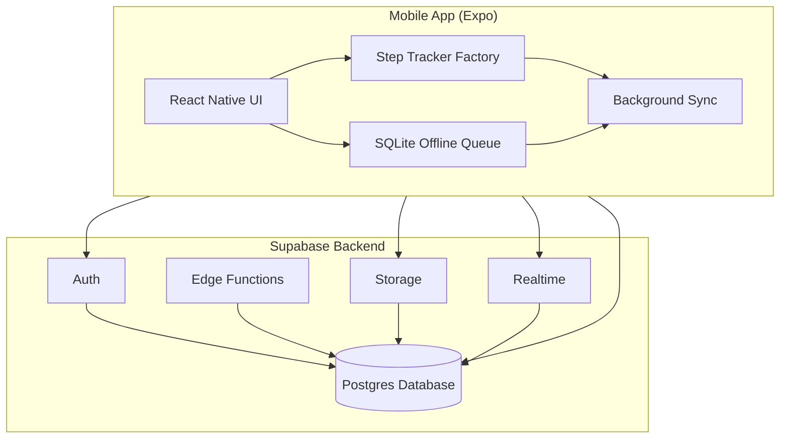
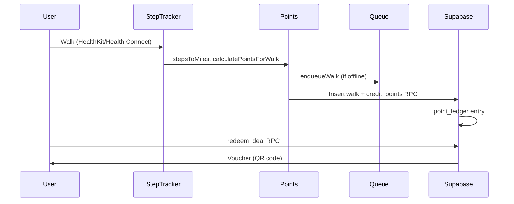

# BiteWalk Architecture

## Overview

BiteWalk is a walk-to-earn rewards app. Users earn points by walking, then redeem them for local restaurant and business deals. The mobile app tracks steps via platform health APIs (HealthKit on iOS, Health Connect on Android), calculates points, and syncs walk records to a Supabase backend. Points can be redeemed for vouchers at nearby businesses.

## Tech Stack

| Layer | Technology |
|-------|------------|
| Mobile | Expo SDK 54, React Native 0.81 |
| Language | TypeScript |
| Backend | Supabase (Auth, Postgres, Edge Functions, Storage, Realtime) |
| Monorepo | npm workspaces |

## Architecture Diagram



## Monorepo Structure

```
mti/
├── package.json           # Root Expo app + workspace config
├── app/                   # Expo Router screens
├── lib/                   # App logic (step tracker, offline queue, supabase)
├── hooks/                 # React hooks
├── packages/
│   └── shared/            # Shared types + points logic
│       └── src/
│           ├── index.ts   # Re-exports
│           ├── points.ts # Points calculation
│           └── types.ts  # Shared types
├── apps/                  # Future: business dashboard (Next.js)
└── supabase/             # Shared by all apps
    ├── migrations/
    └── schema.sql
```

- **Root**: The Expo mobile app. `package.json` defines workspaces for `packages/*` and `apps/*`.
- **packages/shared**: Shared types and points logic. Consumed via `@bitewalk/shared` alias. Re-exports from `index.ts`.
- **apps/**: Reserved for the business dashboard (Next.js). Not yet implemented.
- **supabase/**: At root, shared by mobile app and future dashboard.

## Data Flow



1. **User walks** – Step tracker reads from HealthKit (iOS) or Health Connect (Android).
2. **Points calculation** – `@bitewalk/shared` provides `stepsToMiles`, `calculatePointsForWalk` (100 points per mile).
3. **Walk record** – Insert into `walks` table; `credit_points` RPC creates `point_ledger` entry.
4. **Offline** – Failed inserts go to SQLite `offline_walk_queue`; background sync retries.
5. **Redemption** – User calls `redeem_deal` RPC; receives voucher with QR code for business validation.

## Key Patterns

### Platform-Specific Step Trackers (Factory Pattern)

`lib/step-tracker-factory.ts` returns `IOSStepTracker` or `AndroidStepTracker` based on `Platform.OS`. Both implement the `StepTracker` interface (`requestPermissions`, `checkPermissions`, `getStepsForDate`, `getDistanceForDate`, `subscribeToSteps`). Web throws; only iOS and Android are supported.

### Offline-First with SQLite Queue

`lib/offline-walk-queue.ts` uses `expo-sqlite` to persist walks when Supabase is unreachable. `enqueueWalk` stores walk data; `syncQueuedWalks` retries inserts and calls `credit_points` on success. Background sync runs `syncQueuedWalks` before processing new steps.

### Background Sync (15 Minutes)

`lib/background-step-sync.ts` registers an `expo-background-fetch` task with `minimumInterval: 15 * 60` seconds. The task fetches steps from the step tracker, computes delta since last sync, creates walk records, and syncs queued walks. Runs even when app is backgrounded.

### Re-exports from Shared Package

`packages/shared` exposes `./points`, `./types`, and `.` (index). Consumers import from `@bitewalk/shared` or `@bitewalk/shared/points` to avoid circular deps and keep a single source of truth.

## Security

- **RLS**: Row Level Security enabled on all public tables. Policies enforce "own data" access (e.g. `auth.uid() = user_id`).
- **Security definer functions**: `credit_points`, `debit_points`, `get_points_balance`, `redeem_deal`, `validate_voucher`, `get_nearby_deals` run with elevated privileges but validate inputs and enforce business rules.
- **PKCE auth flow**: Supabase Auth uses PKCE for OAuth and token exchange.
- **Storage**: `business-assets` bucket has public read for images; authenticated write/update/delete for business owners.
