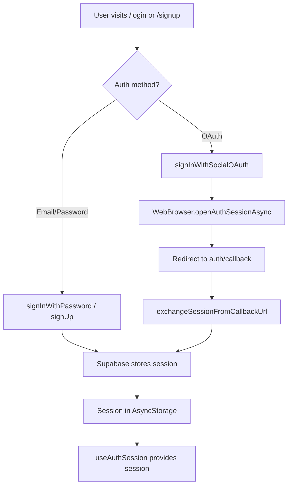

# Auth System

BiteWalk uses Supabase Auth for authentication, supporting email/password and OAuth (Google, Apple).

## Key Files

| File | Purpose |
|------|---------|
| `lib/supabase.ts` | Supabase client creation, AsyncStorage for session persistence |
| `lib/oauth.ts` | Social OAuth flow (signInWithSocialOAuth, exchangeSessionFromCallbackUrl) |
| `hooks/use-auth-session.ts` | React hook exposing session and loading state |
| `app/auth/callback.tsx` | OAuth callback screen handling redirect URL |

## Auth Flow

- **Email/Password**: `supabase.auth.signInWithPassword()` or `supabase.auth.signUp()` on login/signup screens.
- **OAuth**: `signInWithSocialOAuth(provider)` opens the system browser; user completes auth; app receives callback URL and exchanges it for a session.

Session is stored in AsyncStorage (native) or no-op storage (SSR). The client uses `flowType: 'pkce'` and `detectSessionInUrl: false` for mobile-first behavior.

## OAuth Flow

1. `signInWithSocialOAuth('google' | 'apple')` in `lib/oauth.ts`
2. Supabase returns an authorization URL; `WebBrowser.openAuthSessionAsync` opens it
3. User signs in; provider redirects to `auth/callback` with `code` (PKCE) or `access_token` + `refresh_token`
4. `exchangeSessionFromCallbackUrl(callbackUrl)`:
   - If `code` present: `supabase.auth.exchangeCodeForSession(code)`
   - If `access_token` + `refresh_token`: `supabase.auth.setSession({ access_token, refresh_token })`
5. On success, callback screen redirects to `/(tabs)/distance`; on error, shows message and "Back to login"

## Session Management

`useAuthSession` in `hooks/use-auth-session.ts`:

- On mount: `supabase.auth.getSession()` to hydrate initial session
- Subscribes to `supabase.auth.onAuthStateChange` for live updates
- Returns `{ session, isLoading }` for components

## Password Reset

`supabase.auth.resetPasswordForEmail(email)` is used on the forgot-password screen (`app/forgot-password.tsx`). Supabase sends a reset link; the app handles the deep link for password update.

## Row-Level Security (RLS)

All tables use `auth.uid()` for RLS. Policies restrict access so users only see and modify their own data (e.g. `auth.uid() = user_id`).

## Routes

| Route | Purpose |
|-------|---------|
| `/login` | Email/password login, links to signup and forgot-password |
| `/signup` | Registration, links to login |
| `/forgot-password` | Request password reset email |
| `/auth/callback` | OAuth redirect handler |
| `/` | Root redirect: unauthenticated -> `/login`; authenticated -> health onboarding or `/(tabs)/distance` |

Root redirect logic in `app/index.tsx`:

- No session -> `/login`
- Session but no health onboarding -> `/onboarding/health-permissions`
- Session + health onboarded -> `/(tabs)/distance`
