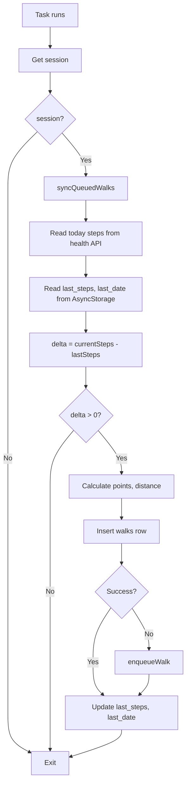

# Background Sync

BiteWalk syncs steps in the background using `expo-background-fetch` and `expo-task-manager` to record walks even when the app is not in the foreground.

## Module

**File**: `lib/background-step-sync.ts`  
**Web stub**: `lib/background-step-sync.web.ts` (no-ops)

## How It Works

1. Registers a background task `STEP_SYNC_TASK` with `expo-background-fetch`
2. Task runs at least every 15 minutes (`minimumInterval: 15 * 60`)
3. On each run: syncs queued walks, reads today's steps, computes delta, inserts new walk or enqueues on error

## Task Configuration

```typescript
await BackgroundFetch.registerTaskAsync(TASK_NAME, {
  minimumInterval: 15 * 60,  // 15 minutes
  stopOnTerminate: false,
  startOnBoot: true,
});
```

## Sync Logic



## State Tracking

| AsyncStorage Key | Purpose |
|------------------|---------|
| `step_sync_last_steps` | Last synced step count for today |
| `step_sync_last_date` | Date string (YYYY-MM-DD) of last sync |

Delta is computed only when `last_date === today`; otherwise `lastSteps` is treated as 0.

## Registration

`registerBackgroundStepSync()` is called from `app/(tabs)/_layout.tsx` when:

- `permissionStatus === 'granted'` (health permissions)
- `Platform.OS` is `ios` or `android`

Registration is skipped if the task is already registered. The tab layout imports the platform-specific module (native vs web), so web gets the no-op stub.

## Web Stub

**File**: `lib/background-step-sync.web.ts`

`registerBackgroundStepSync` and `unregisterBackgroundStepSync` are empty functions. Background fetch and task manager are not available on web.
