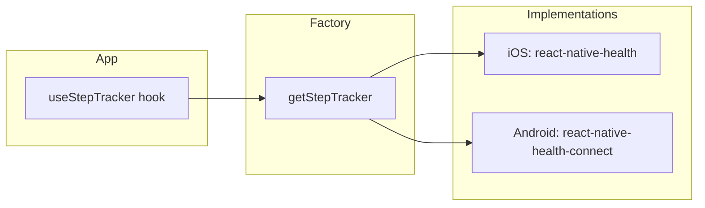

# Step Tracking

BiteWalk tracks steps and walking distance using platform-specific health APIs via an interface + factory pattern.

## Architecture



- **Interface**: `StepTracker` in `lib/step-tracker.ts`
- **Factory**: `getStepTracker()` in `lib/step-tracker-factory.ts` selects implementation by `Platform.OS`
- **Platform implementations**: `lib/step-tracker.ios.ts`, `lib/step-tracker.android.ts`

## StepTracker Interface

```typescript
// lib/step-tracker.ts
export interface StepTracker {
  requestPermissions(): Promise<PermissionStatus>;
  checkPermissions(): Promise<PermissionStatus>;
  getStepsForDate(date: Date): Promise<number>;
  getDistanceForDate(date: Date): Promise<number>; // miles
  subscribeToStepUpdates(callback: (steps: number) => void): () => void;
}
```

## iOS Implementation

**File**: `lib/step-tracker.ios.ts`  
**Library**: `react-native-health` (Apple HealthKit)

- **Permissions**: StepCount, DistanceWalkingRunning (read-only)
- **Data**: `getStepCount` and `getDistanceWalkingRunning` for the given date (start of day)
- **Updates**: 30-second polling via `subscribeToStepUpdates` (HealthKit has no live observers)

## Android Implementation

**File**: `lib/step-tracker.android.ts`  
**Library**: `react-native-health-connect`

- **Permissions**: Steps and Distance records (read)
- **Data**: `readRecords('Steps', ...)` and `readRecords('Distance', ...)` with `timeRangeFilter` for start/end of day
- **Distance**: Sums meters from records, converts to miles (0.000621371 m -> mi)
- **Updates**: 30-second polling (Health Connect has no live observers)

## Factory

**File**: `lib/step-tracker-factory.ts`

- Uses `Platform.OS` to choose `IOSStepTracker` or `AndroidStepTracker`
- Caches a single instance per app lifecycle
- Throws on unsupported platforms (e.g. web)

## Web Support

Step tracking is not supported on web. The factory throws when `Platform.OS` is not `ios` or `android`. There is no `step-tracker.web.ts` stub; the hook handles unsupported platforms via `isSupported`.

## Hook: useStepTracker

**File**: `hooks/use-step-tracker.ts`

Returns:

| Property | Type | Description |
|----------|------|-------------|
| `todaySteps` | number | Steps for today |
| `todayDistance` | number | Miles walked today |
| `permissionStatus` | `'granted' \| 'denied' \| 'undetermined'` | Current permission state |
| `requestPermissions` | () => Promise<PermissionStatus> | Request health permissions |
| `isSupported` | boolean | `Platform.OS === 'ios' \|\| 'android'` |

On supported platforms with granted permissions, the hook subscribes to step updates and derives `todayDistance` from `stepsToMiles` (from `lib/points.ts`).

## Permissions

Permissions are requested during onboarding in `app/onboarding/health-permissions.tsx`:

- Uses `useStepTracker().requestPermissions()`
- Platform-specific copy for Apple Health vs Health Connect
- User can "Enable Step Tracking" or "Skip for now"; completion is stored in AsyncStorage (`health_permission_completed`)
